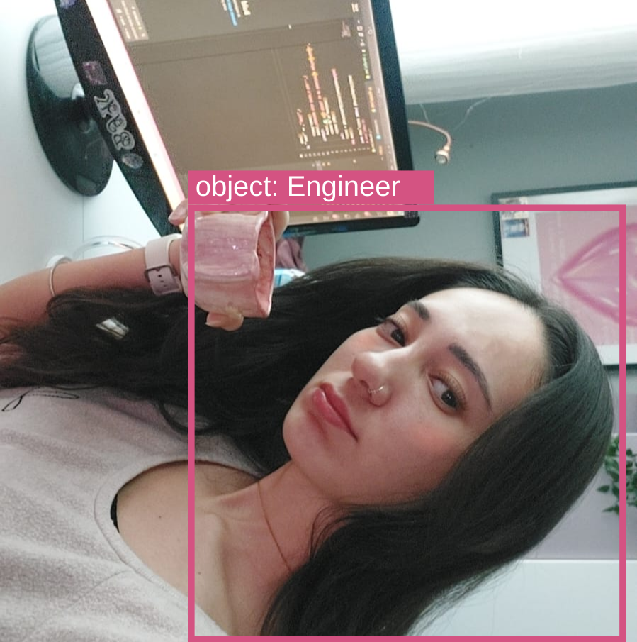

  

### Computer Engineer | Automation Engineer | AI & Computer Vision Enthusiast 

---

### 🎀 About Me 

<table>
  <tr>
    <td>
      I’m a <b>Computer Engineer</b> and <b>Test Automation Engineer</b>, working on end-to-end test automation with <b>Python</b> and <b>Selenium</b>. I design and maintain <b>E2E frameworks</b> with an emphasis on reliability and ease of maintenance.
        
      I also work on <b>computer vision</b> projects, mainly real-time object detection and spatial understanding. In previous projects, I used <b>YOLO</b> and <b>OpenCV</b> to build <b>safety-focused</b> visual detection systems.
    </td>
    <td width="25%">
      
    </td>
  </tr>
</table>

---

### ✨ Philosophy

<table>
  <tr>
    <td width="20%" align="center">
      
    </td>
    <td width="80%">
      <blockquote>
        For me, creating is a journey that includes design, analysis, and management. I enjoy managing a project from the very beginning to the final result. It is important for me to add my own perspective to every stage. Whether I am writing code or building a model, creating something from zero is what truly motivates me.
      </blockquote>
    </td>
  </tr>
</table>

---

## Languages & Tools

### Programming Languages

 

### Computer Vision / ML

 

### 🤖 Generative AI

 

### Tools & Technologies

 

---

### 📊 GitHub Stats

<table>
  <tr>
    <td align="center">
      
    </td>
    <td align="center">
      
    </td>
  </tr>
</table>

