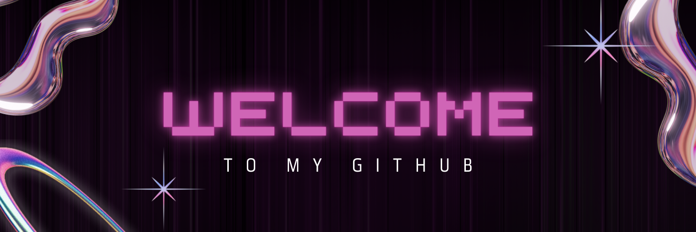

  

### 👩‍💻 Computer Engineer | Automation Engineer | AI & Computer Vision Enthusiast  

---

### 🎀 About Me 

<table>
  <tr>
    <td>
      I am a <b>Computer Engineer</b>  and <b>Automation Engineer</b>  based in Türkiye, currently bridging the gap between robust software quality and intelligent systems. While I spend my days building scalable <b>E2E Automation Frameworks</b> (Python/Selenium), my true passion lies at the intersection of <b>Artificial Intelligence and Computer Vision</b> .
        
      I believe that engineering is as much about aesthetics as it is about logic. Whether I am architecting a test suite or training a neural network, I am driven by the desire to design systems that are both functional and visually intuitive.
        
      🌸 <b>Working on:</b> Engineering a scalable E2E Test Framework at <b>D Kare Bilgi Teknolojileri</b>. 
      🧠 <b>Deep Dive:</b> Advancing my expertise in <b>AI-powered Computer Vision</b>, focusing on real-time object detection and spatial intelligence. 
      👁️ <b>CV Background:</b> Developed high-impact safety systems using <b>YOLO & OpenCV</b>, turning complex visual data into actionable insights. 
    </td>
    <td width="25%">
      
    </td>
  </tr>
</table>

---

### ✨ Philosophy

<table>
  <tr>
    <td width="20%" align="center">
      
    </td>
    <td width="80%">
      <blockquote>
        "For me, creation is a holistic journey. Whether it’s a line of code, a machine learning model, or a digital canvas, I love designing every dimension of a project. It is this constant urge to create to build something where nothing existed that truly keeps me alive."
      </blockquote>
    </td>
  </tr>
</table>

---

### 🛠️ Tech Stack & Tools

---

### 📊 GitHub Stats

<table>
  <tr>
    <td align="center">
      
    </td>
    <td align="center">
      
    </td>
  </tr>
</table>

