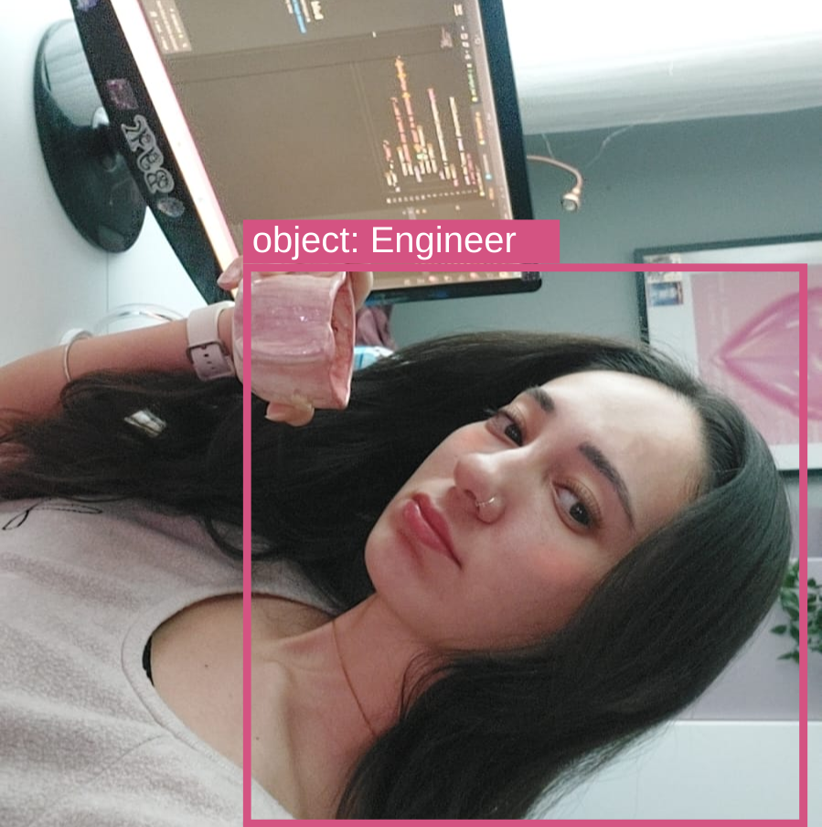

  

<h1 align="center">Zeynep Şevval Düzel</h1>
<h3 align="center">
  Software &amp; QA Engineer &nbsp;·&nbsp; AI Automation Engineer &nbsp;·&nbsp; Computer Engineer
  &nbsp;
</h3>

---

### 🎀 About Me

<table>
  <tr>
    <td>
      I'm a <b>Computer Engineer</b> working across <b>software engineering, QA, and AI automation</b>. I founded and built <a href="#-featured-projects"><b>Davetiye Dijital</b></a>, a config-driven wedding-invitation SaaS platform, and currently ship AI-powered products and client tooling at <a href="https://artydigital.com.tr"><b>Arty Digital</b></a> — an AI-native digital agency based in Türkiye.
        
      My other lane is <b>quality</b> — I've built QA processes from zero, authored 200+ structured test cases, and shipped Selenium suites that cut manual regression effort by up to 70%. I like owning a system end-to-end: architecture, automation, and the edge cases nobody else thought to test.
        
      I also have a background in <b>computer vision</b> (YOLO, OpenCV, Raspberry Pi) and <b>embedded systems</b> (MSP430, C) — which means I bring an engineering mindset to everything I build with AI.
    </td>
    <td width="25%" align="center">
      
    </td>
  </tr>
</table>

---

### ✨ Philosophy

<table>
  <tr>
    <td width="20%" align="center">
      
    </td>
    <td width="80%">
      <blockquote>
        Good engineering and good QA come from the same instinct: assume it breaks, then go find how. I write prompts that respect token limits, design automations that handle edge cases, and build products that hold up after the demo ends — not just during it. Creating something from zero, with full ownership over the process, is what keeps me going.
      </blockquote>
    </td>
  </tr>
</table>

---

## 🛠️ Stack & Tools

**💻 Programming & Web**
 

  

**🧪 QA & Test Automation**
 

  

**🤖 AI & Automation**
 

  

**👁️ Computer Vision / ML**
 

  

**☁️ Backend, Cloud & DevOps**
 

---

## 🚀 Featured Projects

<table>
  <tr>
    <td width="50%" valign="top">
      <h3>💌 Davetiye Dijital</h3>
      <i>AI-Powered Wedding Invitation SaaS — Founder &amp; Lead Engineer</i>
      <ul>
        <li>Config-driven Next.js/React platform: couples launch a customized, RSVP-enabled invitation site in under 5 minutes</li>
        <li>Shared-component, multi-template architecture across 7+ design directions (modern-illustrative, dark-dramatic, botanical, classic, luxury, vintage)</li>
        <li>AI-assisted design pipeline: trend research → AI-generated hero visuals → Kling-based animation → Framer Motion overlays</li>
      </ul>
    </td>
    <td width="50%" valign="top">
      <h3>🏊 Pool Alert</h3>
      <i>Edge AI Real-Time Safety System</i>
      <ul>
        <li>YOLOv5 + OpenCV on Raspberry Pi 5, real-time child detection at &lt;200ms latency</li>
        <li>Custom height-estimation logic cut false positives by ~35% under variable outdoor lighting</li>
        <li>Validated across 20+ structured test scenarios (camera angle, shadow interference)</li>
      </ul>
    </td>
  </tr>
  <tr>
    <td width="50%" valign="top">
      <h3>🏀 BasketVision</h3>
      <i>AI-Powered Sports Analytics</i>
      <ul>
        <li>Python + YOLOv8 basketball tracking and analysis tool</li>
        <li>85%+ detection precision for players and ball across 10+ game sequences</li>
      </ul>
    </td>
    <td width="50%" valign="top">
      <h3>🏢 Corporate Web Solutions</h3>
      <i>Legal, Medical &amp; Fitness</i>
      <ul>
        <li>GSAP-animated sites shipped for 3+ law firms and fitness clients</li>
        <li>E-commerce medical supplies platform (Yonca Grup Medikal) with sub-2s load times</li>
      </ul>
    </td>
  </tr>
</table>

---

## 📌 Currently

- 🔭 Building AI-powered products &amp; automations at **Arty Digital**
- 🧪 Founder &amp; lead engineer on **Davetiye Dijital**
- 🎓 Pursuing a second degree in **Management Information Systems** at Anadolu University
- 🌍 English (C1) · Turkish (Native) · Arabic (A2) · Spanish (A2)

---

### 📊 GitHub Stats

<table>
  <tr>
    <td align="center">
      
    </td>
    <td align="center">
      
    </td>
  </tr>
</table>

